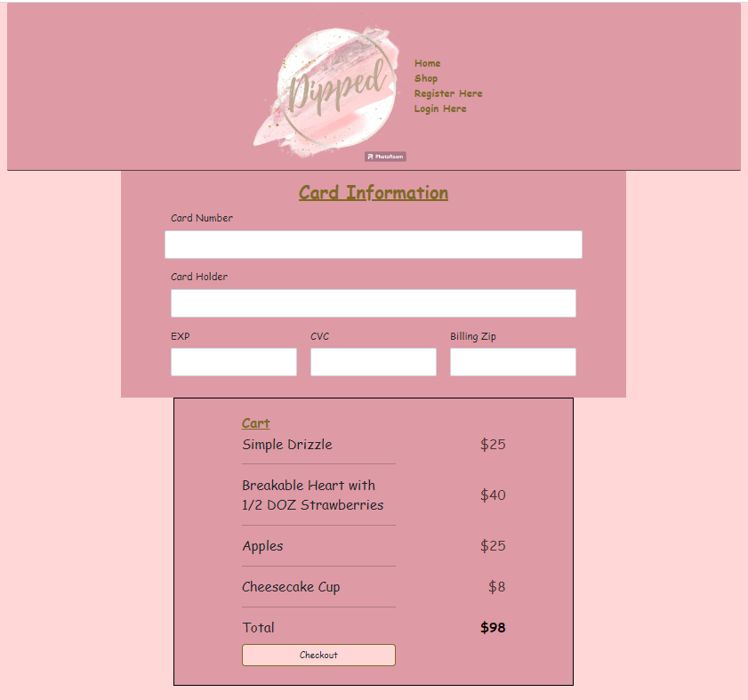

# Ecommerce

Building my first e-commerce website.

**_Purpose_**
A website to sell my friends chocolate covered confectionaries. I wanted to help my friends business as it grows larger.

**_Page Images_**
Main Page:

Products

Login

Registration

Checkout

**_Interesting HTML/CSS_**
I think my favorite part of my html is the code I used to make the strawberry add to cart buttons. Below is the code for the button.

<a
                      href="#"
                      class="btn btn-primary"
                      style="background: none; border-color: black"
                      >Add to Cart</a
                    >
